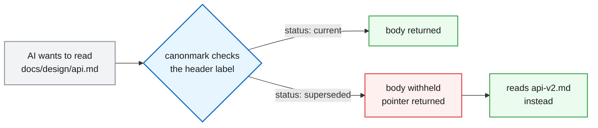
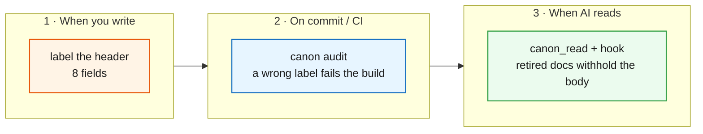

# canonmark

*English · [简体中文](README.zh-CN.md)*

> **Tell your AI which doc to trust.**

Your `docs/` folder is context now. AI coding agents read every file in it as authoritative — including the one you superseded three months ago and the spec describing an endpoint you already deleted. Formatting, prose, and link checks all pass, yet nothing ever asks the one question that matters: **does this doc still count?**

canonmark asks it.



The last step is the point: a retired doc's body **never enters the context window**, so it cannot become the thing the agent pattern-matches against later.

## Three places it plugs in



Step 1 is human work; steps 2 and 3 are machine work. Step 1 alone already pays: in a controlled experiment, labels alone moved agents from "probably this one, please confirm" to a confident, correct call.

## Quick start

```bash
pip install git+https://github.com/deanjo/canonmark
```

Requires Python 3.9+ (CI covers 3.9 through 3.13). PyYAML comes with it, so a fresh install works out of the box.

```bash
canon init          # scaffold canonmark.toml and print the wiring snippets
canon audit docs/   # audit the labels; non-zero exit when they are wrong
canon doctor        # print a read-only doc check-up brief for an AI session
canon read <file>   # read through the contract (retired docs withhold the body)
canon index         # compact label listing
canon mcp           # run as an MCP server so agents get canon_read as a tool
canon hook          # PreToolUse hook: deny direct reads of retired docs
```

### It won't turn your existing repo red on day one

Point canonmark at a years-old `docs/` with no labels anywhere and it exits **0**. The rule: **what you haven't done isn't a failure; what you did wrong is.** Untagged docs and missing navigation are notices with a next step; only a doc that *carries* a label and gets it wrong fails the gate. Adopt one document at a time.

Once a library is fully governed, set `adoption_mode = "strict"` in `canonmark.toml` and structural gaps fail again — that is how canonmark audits itself.

## The authority contract: 8 fields

Goes in the header of each key doc:

```yaml
---
status: superseded                    # current / background / archive / superseded
applies_when: when this doc should lead
not_for: where it must not lead
current_authority: historical-evidence
supersedes: []
superseded_by:
  - docs/design/api-v2.md             # what replaced it
owner: who maintains it
last_reviewed: 2026-09-20
---
```

Agents evaluate `superseded_by → status → not_for → applies_when → current_authority`, in that order — **header first, body only if it earns it.** Full spec in [protocol.md](docs/design/protocol.md).

## Wire it into your gate

Pre-commit — add to `.pre-commit-config.yaml`, then `pre-commit install`:

```yaml
repos:
  - repo: https://github.com/deanjo/canonmark
    rev: v0.1.0
    hooks:
      - id: canon-audit
```

GitHub Actions:

```yaml
      - uses: deanjo/canonmark@main
        with:
          path: docs/
```

> **`Executable canon not found`?** pre-commit runs in its own environment, so `canon` must be on the `PATH` of the process making the commit. Activate the virtualenv first, or prefix with `PATH="$PWD/.venv/bin:$PATH"`.

## Make agents read the label first

Both snippets print themselves — paste and you're done:

```bash
canon init --print-mcp     # .mcp.json: gives the agent canon_read as a tool
canon init --print-hook    # .claude/settings.json: PreToolUse interception
```

MCP **offers** the right tool; the hook **enforces** it:

```console
$ canon read docs/design/old-api-contract.md
docs/design/old-api-contract.md — 已作废（status: superseded）
本文档不再有效，正文按权威契约不予返回。
请改读以下现行文档：
  - docs/design/new-api-contract.md
```

With the hook installed, an agent reaching for its built-in reader on that same file is denied and handed the same pointer.

## Honest limits

What the tool cannot do, stated here rather than buried:

- **The hook is not airtight.** It intercepts the `Read` tool and common `Bash` read forms (`cat`, `head`, `grep`, `sed`, …). Reads via `python`, `perl`, or `xxd`, and relative-path drift after a `cd`, are not caught.
- **A broken turnstile always opens.** If it cannot parse the event, the config, or the file, it stays silent and the read proceeds — a broken gate must never lock you out of your own library.
- **`canon_read`'s benefit *over labels alone* is still unproven.** In the controlled experiment the control group answered correctly without the tool; the one quantified gain is context cost, since a retired doc's output length is fixed and does not grow with the document. Full record in [acceptance.md](docs/acceptance.md).
- **Contradictions in prose are out of reach.** When two bodies disagree but both labels are valid, the machine has nothing to catch — a human or an AI still has to judge.

## Where it fits

| Tool | Governs |
|---|---|
| `markdownlint` / `Vale` / `lychee` | Formatting, prose, broken links |
| `AGENTS.md` | Instructions for the agent (how to work) |
| **canonmark** | **Document authority & lifecycle — which doc to trust, and for how long** |

In one line: **AGENTS.md tells the agent how to work; canonmark tells the agent which doc to trust.**

CJK documentation is a first-class citizen here: field values, scenario descriptions, and audit output all support Chinese natively, so a Chinese-language `docs/` gets the same guarantees as an English one.

## Docs

- [protocol.md](docs/design/protocol.md) — the 8-field contract and five-step protocol, in full
- [vision.md](docs/design/vision.md) — the problem, and how canonmark differs from adjacent projects
- [acceptance.md](docs/acceptance.md) — the verification matrix and honest limits

## License

MIT — see [LICENSE](LICENSE).
