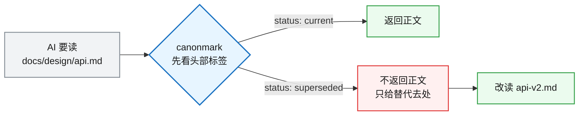
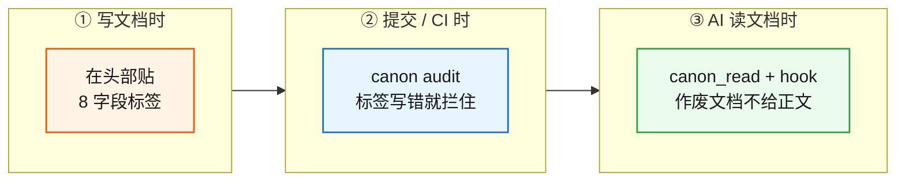

# canonmark

*[English](README.md) · 简体中文*

> **告诉 AI,该信哪篇文档。**

你的 `docs/` 现在是 AI 的上下文。AI 编程助手把里面每一篇都当权威来读——包括你三个月前废掉的那篇、描述着早已删除接口的那份规范。格式检查、措辞检查、断链检查都过了,却没有任何一道检查会问:**这篇还算不算数?**

canonmark 就是补这一问的。



关键在最后一步:作废文档的**正文根本不会进入 AI 的上下文窗口**,所以它不可能成为 AI 后来拿去模仿的那段代码。

## 三处接线,各管一段



① 是人的动作,②③ 是机器的动作。只做 ① 就已经有效——受控实验里,光贴标签就让 AI 从「大概是这篇吧,你确认一下」变成了确定且正确的判断。

## 快速开始

```bash
pip install git+https://github.com/deanjo/canonmark
```

需要 Python 3.9 以上(CI 实测覆盖 3.9–3.13)。PyYAML 会自动装上,装完即可用。

```bash
canon init          # 生成 canonmark.toml,并打印接线配置
canon audit docs/   # 审计标签;写错时退出码非 0
canon doctor        # 打印给 AI 的只读文档体检任务单
canon read <文件>   # 按契约读一篇(作废的不给正文)
canon index         # 紧凑的标签清单
canon mcp           # 以 MCP server 运行,把 canon_read 送进 AI 工具面
canon hook          # PreToolUse 钩子,拦下 AI 对作废文档的直接读取
```

### 它不会让你的老仓第一天变红

把 canonmark 指向一个多年没有任何标签的 `docs/`,退出码是 **0**。规矩是:**没做的事不罚,做错的事才罚。** 没贴标签、缺导航,都只是提示并给出下一步;只有**已经贴了标签却写错**的才判失败。所以你可以一篇一篇地采用。

治理完成后在 `canonmark.toml` 里改成 `adoption_mode = "strict"`,结构性缺口重新判失败(canonmark 就是这样审自己的)。

## 权威契约:8 个字段

贴在关键文档的头部:

```yaml
---
status: superseded                    # current / background / archive / superseded
applies_when: 什么场景该读这篇
not_for: 什么场景不该让它主导
current_authority: historical-evidence
supersedes: []
superseded_by:
  - docs/design/api-v2.md             # 被谁取代了
owner: 谁维护
last_reviewed: 2026-09-20
---
```

AI 按 `superseded_by → status → not_for → applies_when → current_authority` 五步判定,**先读头部,再决定读不读正文**。完整规范见 [protocol.md](docs/design/protocol.md)。

## 接进门禁

pre-commit —— 加进 `.pre-commit-config.yaml` 后 `pre-commit install`:

```yaml
repos:
  - repo: https://github.com/deanjo/canonmark
    rev: v0.1.0
    hooks:
      - id: canon-audit
```

GitHub Actions:

```yaml
      - uses: deanjo/canonmark@main
        with:
          path: docs/
```

> 钩子报 `Executable canon not found`:pre-commit 在自己的环境里跑,`canon` 必须在提交进程的 `PATH` 上。先激活虚拟环境,或给命令加前缀 `PATH="$PWD/.venv/bin:$PATH"`。

## 让 AI 先读标签

两段配置都能直接打印,粘贴即可:

```bash
canon init --print-mcp     # .mcp.json:把 canon_read 送进 AI 的工具面
canon init --print-hook    # .claude/settings.json:PreToolUse 拦截
```

MCP 那份是**提供**正确的工具,hook 那份是**强制**它。效果:

```console
$ canon read docs/design/old-api-contract.md
docs/design/old-api-contract.md — 已作废（status: superseded）
本文档不再有效，正文按权威契约不予返回。
请改读以下现行文档：
  - docs/design/new-api-contract.md
```

装上 hook 后,AI 用内置读取工具去碰这篇,会直接被拒,并收到同一个替代去处。

## 诚实边界

工具做不到的事,写在这里而不是藏起来:

- **hook 不是铁桶。** 它拦 `Read` 工具,以及 `cat`/`head`/`grep`/`sed` 等常见 `Bash` 读取形态;`python`、`perl`、`xxd` 这类读法,以及 `cd` 之后的相对路径漂移,不拦。
- **闸机坏了一律放行。** 解析不了事件、配置或文件时保持沉默,让读取照常进行——一个坏掉的闸机绝不能把你锁在自己的文档库外面。
- **`canon_read` 相对「只贴标签」的增量收益,至今没被证明。** 受控实验里对照组不用工具也答对了;可量化的只有上下文开销(作废文档的输出长度固定,不随文档变长)。完整记录见 [acceptance.md](docs/acceptance.md)。
- **正文层的矛盾抓不到。** 两篇文档正文对同一件事给出相反说法、而标签层完全合规时,机器无能为力,仍需人或 AI 判断。

## 它站在哪一层

| 工具 | 管什么 |
|---|---|
| `markdownlint` / `Vale` / `lychee` | 格式、措辞、断链 |
| `AGENTS.md` | 给 AI 的工作指令(怎么干活) |
| **canonmark** | **文档权威与生命周期——该信哪篇,信到什么时候** |

一句话:**AGENTS.md 告诉 AI 怎么干活,canonmark 告诉 AI 该信哪篇文档。**

中文文档在这里是一等公民:字段值、场景描述、审计输出全部原生支持中文,一个中文文档库得到和英文库一样的保证。

## 文档

- [protocol.md](docs/design/protocol.md) —— 8 字段契约与五步判定的完整规范
- [vision.md](docs/design/vision.md) —— 为什么做,与同类项目的差异
- [acceptance.md](docs/acceptance.md) —— 验收矩阵与诚实边界

## 许可

MIT —— 见 [LICENSE](LICENSE)。
